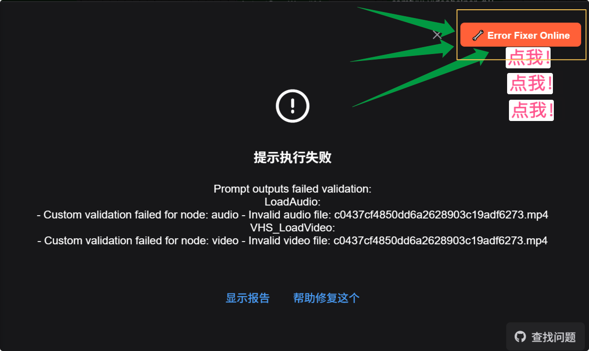

# ComfyUI Error Fixer Plugin

[](https://github.com/programming-pupil/ComfyUI_ErrorFixer/releases)
[](LICENSE)
[](https://github.com/comfyanonymous/ComfyUI)

A plugin that automatically captures ComfyUI workflow errors and provides fix suggestions.

自动捕获ComfyUI工作流错误并提供修复建议的插件。

## 中文文档：[https://plugin.aix.ink/archives/AIypa6Sq](https://plugin.aix.ink/archives/AIypa6Sq)

## 🚀 Features | 功能特点

- 🔍 **Auto Error Detection** | 自动捕获工作流运行错误
- 🔧 **Fix Button on Nodes** | 在错误节点上显示修复按钮
- 📋 **Solution Dialog** | 错误对话框中自动添加解决方案按钮
- 🌐 **One-Click Solutions** | 一键跳转到解决方案网站
- 🔄 **Non-Intrusive Design** | 完全非侵入式设计

## 📦 Installation | 安装方法

### Method 1: Download Release | 方法1：下载发布版

1. Download the latest release: [V1.0.1](https://github.com/programming-pupil/ComfyUI_ErrorFixer/archive/refs/tags/V1.0.1_RELEASE.tar.gz)
2. Extract to `ComfyUI/custom_nodes/` directory
3. Rename the folder to `ComfyUI_ErrorFixer`
4. Restart ComfyUI

### Method 2: Git Clone | 方法2：Git克隆

```bash
cd ComfyUI/custom_nodes/
git clone https://github.com/programming-pupil/ComfyUI_ErrorFixer.git
```

## 🎯 Usage | 使用方法

1. **Run your workflow** | 运行工作流
2. **When errors occur**, the plugin automatically captures them | 出现错误时，插件会自动捕获
3. **Click the "Error Fixer Online" button** in the error dialog | 点击错误对话框中的"Error Fixer Online"按钮
4. **Or click the 🔧 icon** on the top-right corner of error nodes | 或点击节点右上角的🔧图标
5. **Get redirected to solution website** | 自动跳转到解决方案网站

## 📸 Screenshots | 截图



## 🔧 Requirements | 系统要求

- ComfyUI (latest version recommended)
- Python 3.8+
- Modern web browser

## 🤝 Contributing | 贡献

Contributions are welcome! Please feel free to submit a Pull Request.

欢迎贡献代码！请随时提交Pull Request。

## 📄 License | 许可证

This project is licensed under the MIT License - see the [LICENSE](LICENSE) file for details.

本项目采用MIT许可证 - 详情请查看[LICENSE](LICENSE)文件。

## 🐛 Issues | 问题反馈

If you encounter any issues, please report them on the [GitHub Issues](https://github.com/programming-pupil/ComfyUI_ErrorFixer/issues) page.

如果遇到任何问题，请在[GitHub Issues](https://github.com/programming-pupil/ComfyUI_ErrorFixer/issues)页面报告。

## ⭐ Support | 支持

If you find this plugin helpful, please give it a star! ⭐

如果这个插件对你有帮助，请给个星星！⭐
